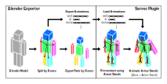

Puppet: Armor Stand Animation Engine
========================
Puppet is a vanilla Minecraft animation engine plugin that
renders Blender skeletal animations with vanilla .json models
controlled by Armor Stands.

Below is a demonstration video comparing ingame model with Blender.
The "glitching" with the model in game is due to client side
interpolation, which is mostly unavoidable:

https://youtu.be/rEhW8e28OxM

Plugin Overview
----------------------------------
Puppet adds animatable objects called **actors** to the world.
The `/actor` command can be used to create and manipulate
these objects. You can create actors, move them around, change
their pose, and play/pause animations.

This plugin itself is minimalistic. It's purely the animation engine
and basic commands for manipulating actors. It does not save/load
any actors created in the game. It also does not allow any
interaction with actors or between actors. It's mainly intended
to be an animation backend for other plugins.

Below is an overview of the system integrated with the
Blender exporter:

Commands
----------------------------------
- `/actor`: Main command for manipulating objects (permissions: **puppet.command.actor**)
- `/puppet`: Engine commands (reload, start/stop, etc...) (permissions: **puppet.command.puppet**)

[See wiki for detailed list](https://github.com/phonon/minecraft-puppet/wiki/Commands)

Blender Exporter and Basic Usage
----------------------------------
**Blender Minecraft .json exporter:** https://github.com/phonon/blender-minecraft-json

**An example model is provided in this plugin's github repo.**

Be sure to read the installation and export guides in the Blender
addon readme. Custom models used with this plugin must follow all
the same  restrictions as vanilla .json models. The basic steps for
creating, exporting, and adding custom models to the Puppet engine on
a server:

1. Create model in Blender (follow all Minecraft .json restrictions).
2. Create an armature (skeleton) and assign all objects in the
model to the bone they should be exported with.
3. Export using the exporter with **Export bones** and
**Export animations** settings selected. This will export model into
several chunks named `model.bone0.json`, `model.bone1.json`, ...
alongside a `model.data.json` file containing bone structure and
animations.
4. Put the Puppet plugin `.jar` into your Minecraft server
`plugins/` folder.
5. Put each custom model and textures into a separate directory in the
`plugins/puppet/data/` folder. E.g. if you have a model named `monster`,
but all its `monster.bone0.json`, `monster.bone1.json`, ... and
`monster.data.json` into `plugins/puppet/data/monster/`. Put all textures
for the model in this folder as well.
6. When the plugin runs, it will automatically generate a resource pack
needed for clients to view the custom models. This will be built into
the folder `plugins/puppet/resourcepack/puppet_resourcepack.zip`.